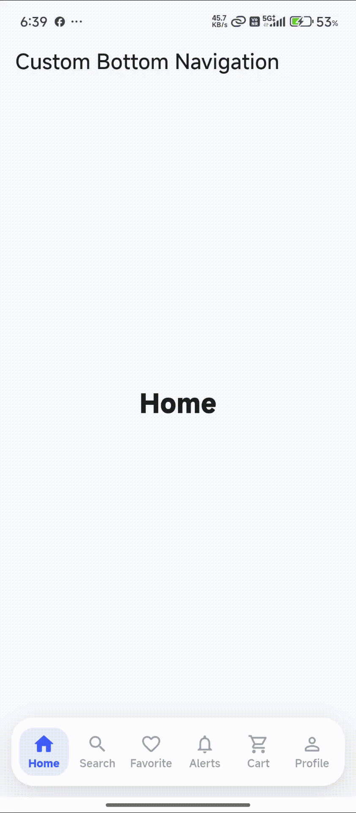

# Flutter Custom Bottom Navigation

A lightweight and customizable bottom navigation widget for Flutter applications.

`flutter_custom_bottom_navigation` provides a clean animated bottom navigation with support for **2 to 6 tabs**, selected/unselected icons, custom typography, colors, spacing, rounded corners, and more.


## Preview

<p align="center">
  
</p>


## Features

* Supports **2 to 6 navigation items**
* Animated tab selection
* Separate `selectedIcon` support
* Custom icon size
* Custom font size
* Custom font family
* Selected and unselected colors
* Custom background color
* Custom navigation height
* Custom margin
* Custom border radius
* Long labels handled with ellipsis
* Safe-area support
* Ripple/tap feedback
* No external dependencies


## Installation

Add the package to your `pubspec.yaml`:

```yaml
dependencies:
  flutter_custom_bottom_navigation: ^1.0.0
```

Then run:

```bash
flutter pub get
```

## Basic Usage

Import the package:

```dart
import 'package:flutter_custom_bottom_navigation/flutter_custom_bottom_navigation.dart';
```

Create your navigation items:

```dart
final List<BottomNavigationItem> items = [
  const BottomNavigationItem(
    icon: Icons.home_outlined,
    selectedIcon: Icons.home,
    label: 'Home',
  ),
  const BottomNavigationItem(
    icon: Icons.search_outlined,
    selectedIcon: Icons.search,
    label: 'Search',
  ),
  const BottomNavigationItem(
    icon: Icons.favorite_border,
    selectedIcon: Icons.favorite,
    label: 'Favorite',
  ),
  const BottomNavigationItem(
    icon: Icons.person_outline,
    selectedIcon: Icons.person,
    label: 'Profile',
  ),
];
```

Add the navigation widget:

```dart
CustomBottomNavigation(
  items: items,
  currentIndex: currentIndex,
  onTap: (index) {
    setState(() {
      currentIndex = index;
    });
  },
)
```

## Complete Example

```dart
import 'package:flutter/material.dart';
import 'package:flutter_custom_bottom_navigation/flutter_custom_bottom_navigation.dart';

void main() {
  runApp(const MyApp());
}

class MyApp extends StatefulWidget {
  const MyApp({super.key});

  @override
  State<MyApp> createState() => MyAppState();
}

class MyAppState extends State<MyApp> {
  int currentIndex = 0;

  final List<BottomNavigationItem> items = [
    const BottomNavigationItem(
      icon: Icons.home_outlined,
      selectedIcon: Icons.home,
      label: 'Home',
    ),
    const BottomNavigationItem(
      icon: Icons.search_outlined,
      selectedIcon: Icons.search,
      label: 'Search',
    ),
    const BottomNavigationItem(
      icon: Icons.favorite_border,
      selectedIcon: Icons.favorite,
      label: 'Favorite',
    ),
    const BottomNavigationItem(
      icon: Icons.notifications_none,
      selectedIcon: Icons.notifications,
      label: 'Alerts',
    ),
    const BottomNavigationItem(
      icon: Icons.shopping_cart_outlined,
      selectedIcon: Icons.shopping_cart,
      label: 'Cart',
    ),
    const BottomNavigationItem(
      icon: Icons.person_outline,
      selectedIcon: Icons.person,
      label: 'Profile',
    ),
  ];

  @override
  Widget build(BuildContext context) {
    return MaterialApp(
      debugShowCheckedModeBanner: false,
      home: Scaffold(
        appBar: AppBar(
          title: const Text('Custom Bottom Navigation'),
        ),
        body: Center(
          child: Text(
            items[currentIndex].label,
            style: const TextStyle(
              fontSize: 28,
              fontWeight: FontWeight.bold,
            ),
          ),
        ),
        bottomNavigationBar: CustomBottomNavigation(
          items: items,
          currentIndex: currentIndex,
          onTap: (index) {
            setState(() {
              currentIndex = index;
            });
          },
          height: 72,
          iconSize: 23,
          fontSize: 11.5,
          fontFamily: 'Roboto',
          backgroundColor: Colors.white,
          selectedColor: const Color(0xFF3D5CFF),
          unselectedColor: const Color(0xFF9AA0A6),
          margin: const EdgeInsets.fromLTRB(12, 0, 12, 12),
          borderRadius: const BorderRadius.all(
            Radius.circular(24),
          ),
        ),
      ),
    );
  }
}
```

## BottomNavigationItem

Each navigation item accepts an icon, an optional selected icon, and a label.

```dart
BottomNavigationItem(
  icon: Icons.home_outlined,
  selectedIcon: Icons.home,
  label: 'Home',
)
```

### Properties

| Property       | Type        | Required | Description                                  |
| -------------- | ----------- | -------- | -------------------------------------------- |
| `icon`         | `IconData`  | Yes      | Icon displayed when the item is not selected |
| `selectedIcon` | `IconData?` | No       | Icon displayed when the item is selected     |
| `label`        | `String`    | Yes      | Text displayed below the icon                |

If `selectedIcon` is not provided, the regular `icon` is used for both states.

## CustomBottomNavigation Properties

| Property          | Type                         | Default         | Description                             |
| ----------------- | ---------------------------- | --------------- | --------------------------------------- |
| `items`           | `List<BottomNavigationItem>` | —               | Navigation items                        |
| `currentIndex`    | `int`                        | —               | Currently selected item                 |
| `onTap`           | `ValueChanged<int>`          | —               | Called when a navigation item is tapped |
| `height`          | `double`                     | `72`            | Navigation height                       |
| `iconSize`        | `double`                     | `23`            | Icon size                               |
| `fontSize`        | `double`                     | `11.5`          | Label font size                         |
| `fontFamily`      | `String?`                    | `null`          | Label font family                       |
| `backgroundColor` | `Color`                      | `Colors.white`  | Navigation background                   |
| `selectedColor`   | `Color`                      | `#3D5CFF`       | Selected icon and text color            |
| `unselectedColor` | `Color`                      | `#9AA0A6`       | Unselected icon and text color          |
| `margin`          | `EdgeInsetsGeometry`         | `12, 0, 12, 12` | Outer navigation margin                 |
| `borderRadius`    | `BorderRadius`               | `24`            | Navigation corner radius                |

## Tab Limit

The widget supports between **2 and 6 items**.

```dart
CustomBottomNavigation(
  items: items,
  currentIndex: currentIndex,
  onTap: (index) {
    setState(() {
      currentIndex = index;
    });
  },
)
```

The widget validates the number of items with an assertion:

```dart
assert(
  items.length >= 2 && items.length <= 6,
  'CustomBottomNavigation works best with 2 to 6 items.',
);
```

## Selected Icon

Use `selectedIcon` when you want different icons for selected and unselected states.

For example:

```dart
BottomNavigationItem(
  icon: Icons.home_outlined,
  selectedIcon: Icons.home,
  label: 'Home',
)
```

Without a selected icon:

```dart
BottomNavigationItem(
  icon: Icons.home,
  label: 'Home',
)
```

The same icon will be used in both states.

## Custom Styling

The navigation can be customized without modifying the package source:

```dart
CustomBottomNavigation(
  items: items,
  currentIndex: currentIndex,
  onTap: (index) {
    setState(() {
      currentIndex = index;
    });
  },
  height: 76,
  iconSize: 25,
  fontSize: 13,
  fontFamily: 'Roboto',
  backgroundColor: Colors.black,
  selectedColor: Colors.white,
  unselectedColor: Colors.grey,
  margin: const EdgeInsets.fromLTRB(16, 0, 16, 16),
  borderRadius: const BorderRadius.all(
    Radius.circular(28),
  ),
)
```

## Animation

The widget includes lightweight animations for:

* Selected background
* Icon scaling
* Icon changes
* Text color
* Text weight

The animations are built with Flutter's standard animation widgets and require no additional package.

## Label Handling

Long labels are limited to one line:

```dart
Text(
  item.label,
  maxLines: 1,
  overflow: TextOverflow.ellipsis,
)
```

For example, a long label will automatically become:

```text
Notifications...
```

This helps keep all six navigation items within the available width.

## Design

The component uses a simple layout based on Flutter's standard widgets:

* `Row`
* `Expanded`
* `Material`
* `InkWell`
* `AnimatedContainer`
* `TweenAnimationBuilder`
* `AnimatedDefaultTextStyle`

This keeps the package lightweight and easy to integrate into existing Flutter applications.

## Example

The package includes a complete example application demonstrating a six-tab navigation:

* Home
* Search
* Favorite
* Notifications
* Cart
* Profile

To run the example:

```bash
cd example
flutter run
```

## Requirements

* Flutter
* Dart
* Material Design

No additional dependencies are required.

## License

MIT License

Copyright (c) 2026 Excelsior Technologies

Permission is hereby granted, free of charge, to any person obtaining a copy
of this software and associated documentation files (the "Software"), to deal
in the Software without restriction, including without limitation the rights
to use, copy, modify, merge, publish, distribute, sublicense, and/or sell
copies of the Software, and to permit persons to whom the Software is
furnished to do so, subject to the following conditions:

The above copyright notice and this permission notice shall be included in all
copies or substantial portions of the Software.

THE SOFTWARE IS PROVIDED "AS IS", WITHOUT WARRANTY OF ANY KIND, EXPRESS OR
IMPLIED, INCLUDING BUT NOT LIMITED TO THE WARRANTIES OF MERCHANTABILITY,
FITNESS FOR A PARTICULAR PURPOSE AND NONINFRINGEMENT. IN NO EVENT SHALL THE
AUTHORS OR COPYRIGHT HOLDERS BE LIABLE FOR ANY CLAIM, DAMAGES OR OTHER
LIABILITY, WHETHER IN AN ACTION OF CONTRACT, TORT OR OTHERWISE, ARISING FROM,
OUT OF OR IN CONNECTION WITH THE SOFTWARE OR THE USE OR OTHER DEALINGS IN THE
SOFTWARE.
